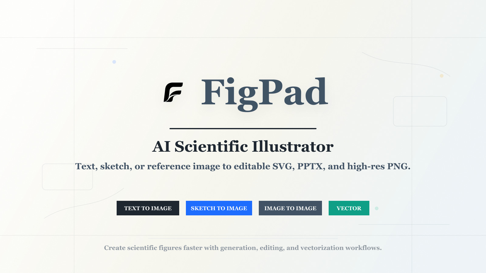

  

<h1 align="center">Figpad</h1>

  <strong>AI-powered scientific illustration, bitmap-to-SVG conversion, and online vector editing for researchers.</strong>

  Turn sketches, screenshots, concepts, and research ideas into publication-ready SVG, PNG, PDF, EPS, and editable PPTX assets.

  
  
  
  

  <a href="https://figpad.ai">Website</a>
  ·
  <a href="https://figpad.ai/zh/generate-figure">AI Figure Generator</a>
  ·
  <a href="https://figpad.ai/zh/svg-converter">SVG Converter</a>
  ·
  <a href="https://figpad.ai/zh/svg-editor">Online SVG Editor</a>

---

## What is Figpad?

**[Figpad](https://figpad.ai)** is a web-based scientific illustration platform built for researchers, scientists, students, and academic creators.

It combines **[AI figure generation](https://figpad.ai/zh/generate-figure)**, **[bitmap-to-SVG conversion](https://figpad.ai/zh/svg-converter)**, and an **[online SVG editor](https://figpad.ai/zh/svg-editor)**, helping researchers create clean, editable, publication-ready scientific figures without spending hours in traditional design tools.

Whether you are preparing a paper, thesis, grant proposal, conference poster, graphical abstract, or lab presentation, **[Figpad](https://figpad.ai)** helps you move from rough idea to polished scientific visual faster.

---

## Core Features

| Feature | What It Does | Try It |
| :--- | :--- | :--- |
| **AI Figure Generator** | Generate scientific diagrams from text prompts using advanced image models such as `GPT-Img-2` and `Nano Banana 2` | **[Generate Figure](https://figpad.ai/zh/generate-figure)** |
| **Bitmap to SVG Converter** | Convert screenshots, sketches, and low-resolution images into clean, scalable vector graphics | **[Convert to SVG](https://figpad.ai/zh/svg-converter)** |
| **Online SVG Editor** | Edit vectors directly in the browser with node manipulation, layers, shapes, text, and styling tools | **[Open SVG Editor](https://figpad.ai/zh/svg-editor)** |
| **Academic Figure Workflow** | Designed for cellular, molecular, materials science, chemical apparatus, neural network, and engineering diagrams | **[Visit Figpad](https://figpad.ai)** |
| **Editable Export** | Export figures in formats suitable for journals, slides, posters, and manuscripts | **[Start Creating](https://figpad.ai)** |

---

## Built for Scientific Use Cases

Use **[Figpad](https://figpad.ai)** to create and refine:

- Cellular and molecular biology illustrations
- Chemical apparatus and reaction workflow diagrams
- Materials science and battery mechanism figures
- Neural network architecture diagrams
- Graphical abstracts
- Experimental workflow diagrams
- Paper and thesis figures
- Conference posters and presentation visuals
- Editable SVG assets for academic publishing

---

## Why Researchers Use Figpad

Traditional illustration tools are powerful, but they are often too slow for scientific workflows.

**[Figpad](https://figpad.ai)** focuses on the needs of academic creators:

- **Prompt to figure**: generate scientific illustrations from natural language with the **[AI Figure Generator](https://figpad.ai/zh/generate-figure)**
- **Image to vector**: turn bitmap screenshots and rough sketches into scalable SVG with the **[SVG Converter](https://figpad.ai/zh/svg-converter)**
- **Edit in browser**: adjust paths, layers, colors, labels, and layout in the **[Online SVG Editor](https://figpad.ai/zh/svg-editor)**
- **Export for publication**: prepare assets for papers, slides, posters, and journal submission
- **Academic-first design**: optimized for research diagrams rather than generic marketing graphics

---

## Open Resources

We maintain free resources for the scientific visualization community.

### awesome-scientific-prompts

A curated collection of production-ready prompts and workflows for scientific illustration.

Includes prompts for:

- Lithium-sulfur batteries
- Molecular and cellular mechanisms
- Deep learning model diagrams
- Materials science illustrations
- Academic graphical abstracts

Repository: [awesome-scientific-prompts](https://github.com/Figpad/awesome-scientific-prompts)

Start creating similar visuals in the **[Figpad AI Figure Generator](https://figpad.ai/zh/generate-figure)**.

### image-to-svg-academic-workflow

Step-by-step guides for converting low-resolution screenshots, paper figures, sketches, and bitmap diagrams into clean, scalable vector graphics.

Repository: [image-to-svg-academic-workflow](https://github.com/Figpad/image-to-svg-academic-workflow)

Try the workflow directly with the **[Figpad SVG Converter](https://figpad.ai/zh/svg-converter)**.

---

## Output Formats

**[Figpad](https://figpad.ai)** supports common academic and design export formats:

- **SVG** for scalable, editable vector graphics
- **PNG** for quick sharing and preview
- **PDF** for academic publishing and print
- **EPS** for journal submission workflows
- **PPTX** for editable presentation figures

Ready to export your next scientific figure? **[Open Figpad](https://figpad.ai)**.

---

## Product Links

- **Website**: [https://figpad.ai](https://figpad.ai)
- **AI Figure Generator**: [https://figpad.ai/zh/generate-figure](https://figpad.ai/zh/generate-figure)
- **SVG Converter**: [https://figpad.ai/zh/svg-converter](https://figpad.ai/zh/svg-converter)
- **Online SVG Editor**: [https://figpad.ai/zh/svg-editor](https://figpad.ai/zh/svg-editor)

---

## Community

We are building **[Figpad](https://figpad.ai)** with researchers, students, labs, and scientific creators.

Follow the project, explore our open resources, and share feedback through GitHub issues or the Figpad community.

---

  <strong>Made for the global research community.</strong>

  <a href="https://figpad.ai"><strong>Start creating publication-ready scientific figures with Figpad →</strong></a>

